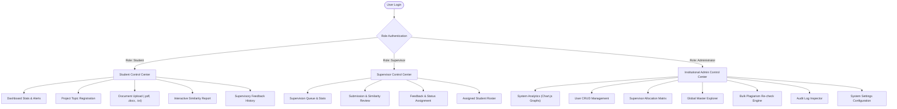
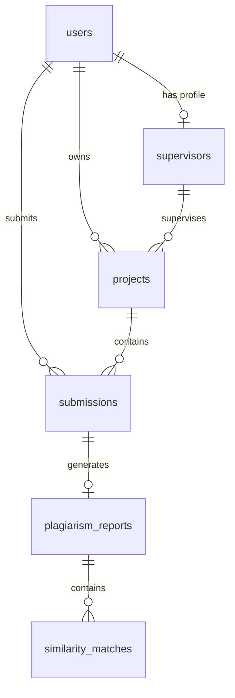
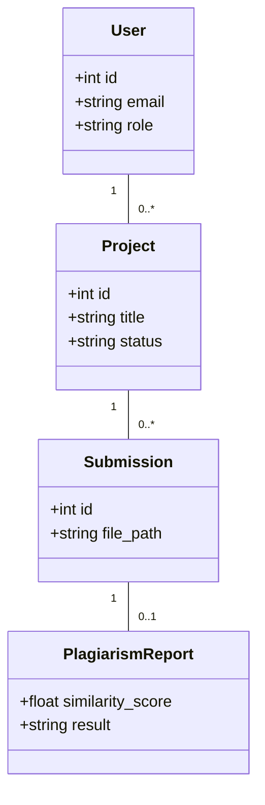
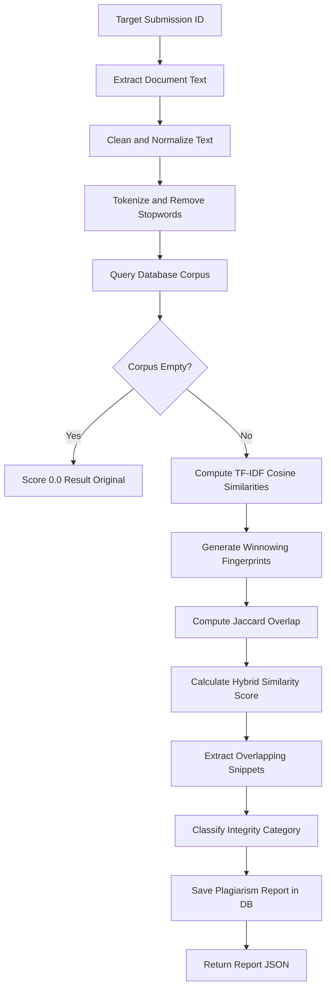
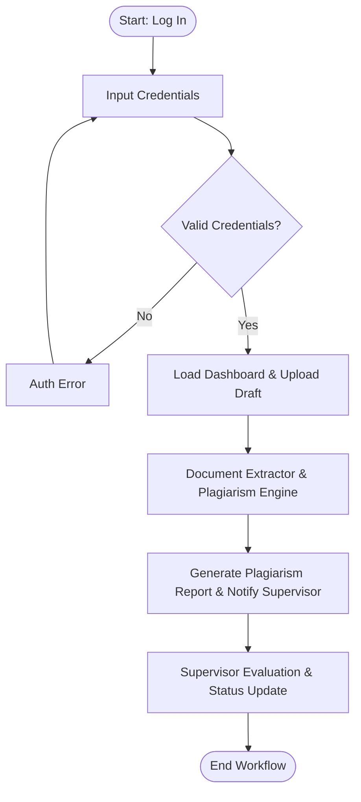
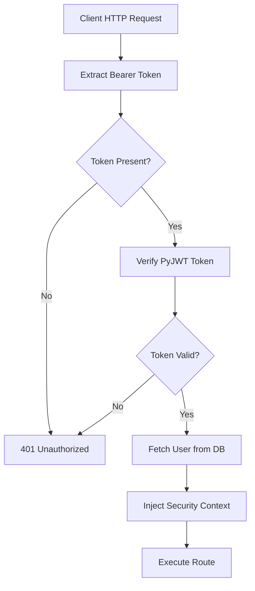

# CHAPTER FOUR: SYSTEM DESIGN AND IMPLEMENTATION

## 4.1 Objectives of the New System
The primary objective of the **AcadGuard** platform is to provide higher educational institutions with a centralized, automated academic project management system integrated with an authentic multi-stage plagiarism detection engine. To mitigate manual tracking inefficiencies and unverified document originality, AcadGuard establishes a robust technological foundation governed by nine core architectural design objectives:

1. **Usability & User Experience**: Implemented via a responsive Vanilla JavaScript Single Page Application (SPA) providing role-tailored navigation for Students, Supervisors, and Administrators with zero full-page browser reloads.
2. **System Reliability**: Guaranteed through transactional SQLite operations managed by SQLAlchemy 2.0 ORM, strict Pydantic V2 schema validation, and structured exception handling across all RESTful API endpoints.
3. **Maintainability & Modularity**: Enforced by a clear separation of concerns comprising modular FastAPI route handlers, decoupled service classes (`DocumentExtractor`, `PlagiarismEngine`), and normalized database entities.
4. **Scalability & Performance**: Facilitated by sublinear term-frequency scaling (`sublinear_tf`) and batch TF-IDF vector matrix computations capable of scaling across expanding institutional document repositories.
5. **System Security & Access Control**: Achieved through stateless JSON Web Token (`PyJWT`) authentication, Bcrypt password hashing (12 salt rounds), Role-Based Access Control (RBAC) guards, and immutable audit logging.
6. **Data Integrity & Consistency**: Maintained via foreign key constraints with explicit cascading delete rules, unique index constraints on matriculation/email fields, and atomic database commits.
7. **Automated Processing Accuracy**: Supported by asynchronous document text extraction handling PyMuPDF (`fitz`), Python-Docx, and UTF-8 plain text with immediate background plagiarism check execution.
8. **Responsive Accessibility**: Delivered through adaptive custom CSS grid/flexbox layouts and interactive Chart.js graphical visualizations optimized for desktop, tablet, and mobile displays.
9. **Storage & Retrieval Efficiency**: Ensured by caching extracted document text directly within the database schema to eliminate redundant file I/O during multi-document plagiarism comparisons.

---

## 4.2 Main Menu (Control Center)
The AcadGuard control center operates as a dynamic, role-governed navigation hub. Upon authenticating via the centralized login interface (`/login.html`), the user's role claim contained within the PyJWT payload determines the active workspace view rendered by `frontend/js/app.js`:

- **Student Dashboard**: Displays active research metrics (Total Projects, Under Review, Approved, Revision Alerts), project topic registration form, drag-and-drop document uploader, interactive similarity score meter, and supervisory feedback history stream.
- **Supervisor Portal**: Provides a real-time supervision queue of pending student drafts, modal document viewer, interactive plagiarism report inspector, timestamped feedback form, and assigned student workload roster.
- **Institutional Admin Control Center**: Features system-wide analytical graphs powered by Chart.js (Project Status Distribution, Plagiarism Similarity Ranges), full user CRUD management, supervisor allocation matrix, global master document explorer, bulk re-check engine, audit logs, and system configuration controls.


*Figure 4.2: Main Menu Control Center Navigation Flowchart*

---

## 4.3 The SubMenus / Subsystem
The AcadGuard architecture decomposes into four interconnected core subsystems:

### 4.3.1 Authentication & Security Subsystem
Handles user identity verification via `POST /api/auth/login`, password hashing via `passlib/bcrypt`, PyJWT token generation (with 24-hour expiration), and role-based route guard injection via `app/core/dependencies.py`.

### 4.3.2 Student & Project Subsystem
Manages research topic registration (`POST /api/projects`), multi-version document uploads (`POST /api/projects/{id}/submissions` up to 25MB), text extraction, and automated student notification feeds.

### 4.3.3 Supervisory Review Subsystem
Empowers faculty supervisors to inspect assigned student submissions (`GET /api/supervision/submissions`), review detailed similarity breakdowns, log timestamped critique, and update submission status (`Approved`, `Revision Required`, `Rejected`).

### 4.3.4 Plagiarism Engine & Analytics Subsystem
Executes the multi-stage Natural Language Processing (NLP) pipeline (`PlagiarismEngine.run_check`), computing batch TF-IDF cosine similarity and Winnowing fingerprint overlap, while supplying administrators with institutional metrics.

```mermaid
flowchart TD
    AcadGuard["AcadGuard Central System"]

    AcadGuard --> AuthSub["1. Authentication & Security Subsystem"]
    AuthSub --> Auth1["Login & Credential Verification"]
    AuthSub --> Auth2["Bcrypt Password Hashing"]
    AuthSub --> Auth3["PyJWT Token Issuance & Verification"]

    AcadGuard --> ProjSub["2. Student & Project Subsystem"]
    ProjSub --> Proj1["Project Registration & Metadata"]
    ProjSub --> Proj2["Versioned Document Upload"]
    ProjSub --> Proj3["Text Extraction Engine"]

    AcadGuard --> SupSub["3. Supervisory Review Subsystem"]
    SupSub --> Sup1["Review Queue Management"]
    SupSub --> Sup2["Plagiarism Report Inspector"]
    SupSub --> Sup3["Timestamped Feedback Logging"]

    AcadGuard --> PlagSub["4. Plagiarism Engine & Admin Subsystem"]
    PlagSub --> Plag1["TF-IDF Vectorizer & Cosine Similarity"]
    PlagSub --> Plag2["Winnowing K-Gram Fingerprinter"]
    PlagSub --> Plag3["Hybrid Score & Overlap Snippet Extractor"]
```


*Figure 4.3: Subsystem Structural Decomposition Diagram*

---

## 4.4 System Specifications

### 4.4.1 Database Development Tool
AcadGuard utilizes **SQLite 3** managed through **SQLAlchemy 2.0 ORM** and **Pydantic V2** schemas. SQLite provides a lightweight, zero-configuration database embedded directly within academic server deployments, ensuring high-speed transactional execution without external database process overhead.

### 4.4.2 Database Design and Structure
The persistent relational schema comprises nine normalized database models defined in `app/models/`: `User`, `Supervisor`, `Project`, `Submission`, `PlagiarismReport`, `SimilarityMatch`, `Feedback`, `Notification`, `AuditLog`, and `Setting`.


*Figure 4.4: Entity Relationship Diagram (ERD)*

### 4.4.3 Math Specification
The Plagiarism Detection Engine implements rigorous mathematical models to quantify text similarity:

1. **Sublinear TF-IDF Vectorization & Inverse Document Frequency**:
   $$	ext{tf}(t, d) = 1 + \log(	ext{f}_{t,d})$$
   $$	ext{idf}(t, D) = \log\left(rac{1 + |D|}{1 + |\{d \in D : t \in d\}|}
ight) + 1$$
   $$	ext{TF-IDF}(t, d, D) = 	ext{tf}(t, d) 	imes 	ext{idf}(t, D)$$

2. **Cosine Similarity Formula**:
   $$	ext{Cosine Similarity}(Q, D_i) = rac{Q \cdot D_i}{\|Q\| \|D_i\|} = rac{\sum_{k} w_{Q, k} w_{D_i, k}}{\sqrt{\sum_{k} w_{Q, k}^2} \sqrt{\sum_{k} w_{D_i, k}^2}}$$

3. **Winnowing K-Gram Fingerprinting & Jaccard Coefficient**:
   $$	ext{Jaccard Similarity}(F_A, F_B) = rac{|F_A \cap F_B|}{|F_A \cup F_B|}$$

4. **Hybrid Similarity Score Formula**:
   $$	ext{Hybrid Score} = egin{cases} (0.35 	imes S_{	ext{tfidf}}) + (0.65 	imes S_{	ext{jaccard}}) & 	ext{if } S_{	ext{jaccard}} > 0.60 \ (0.70 	imes S_{	ext{tfidf}}) + (0.30 	imes S_{	ext{jaccard}}) & 	ext{otherwise} \end{cases}$$

### 4.4.4 Program Module Specification
Backend operations are structured into decoupled Python service modules:
- `PlagiarismEngine` (`app/services/plagiarism/engine.py`): Central orchestrator executing similarity checking, text preprocessing, score calculation, report creation, and notification dispatch.
- `DocumentExtractor` (`app/services/document_extractor.py`): Multi-format file parser utilizing PyMuPDF for PDF text extraction, Python-Docx for Word documents, and UTF-8 fallback for plain text files.
- `AuthService` (`app/services/auth_service.py`): Manages user registration, credential verification, Bcrypt password hashing, and PyJWT token encoding/decoding.


*Figure 4.5: Backend Domain Model UML Class Diagram*

### 4.4.5 Input / Output Format
- **Input Formats**: User Registration, Account Login, Project Topic Registration, Document File Uploader (`.pdf`, `.docx`, `.txt` up to 25MB), Supervisory Feedback Form, Administrative User Search.
- **Output Formats**: Interactive Circular Similarity Gauge (0-100%), Matched Sources Breakdown, Highlighted Overlapping Sentence Snippets, Chart.js Institutional Metrics, Audit Log Explorer, Toast Notifications.

### 4.4.6 Algorithm
**Algorithm 4.1: Hybrid Plagiarism Detection Engine**
```text
Input: submission_id (Integer), db (Session)
Output: report (PlagiarismReport Object)
1. Retrieve target submission; extract text using DocumentExtractor if extracted_text is null.
2. Clean target text: convert to lowercase, strip punctuation, tokenize words.
3. Query existing corpus submissions (excluding target submission ID).
4. For each valid corpus document, compute TF-IDF Cosine Similarity and Winnowing K-Gram Fingerprints.
5. Compute Hybrid Similarity Score = weighted combination of TF-IDF and Jaccard Fingerprint overlap.
6. Extract matching sentence snippets (min 5-gram overlap) and classify result category.
7. Persist PlagiarismReport and SimilarityMatch records; dispatch student/supervisor notifications; return report.
```


*Figure 4.8: Plagiarism Detection Algorithm Flowchart*

### 4.4.7 Data Dictionary
*Table 4.1: Relational Database Data Dictionary*

| Table | Field | Data Type | Constraint | Description / Example |
| :--- | :--- | :--- | :--- | :--- |
| `users` | `id` | INTEGER | PK, Auto | Unique user ID (e.g. 1) |
| `users` | `email` | VARCHAR(255) | Unique, NN | User email (e.g. student@example.com) |
| `users` | `password_hash` | VARCHAR(255) | NOT NULL | Bcrypt hash string |
| `users` | `role` | VARCHAR(50) | NOT NULL | User role (student, supervisor, admin) |
| `supervisors` | `user_id` | INTEGER | FK, Unique | Foreign key references users.id |
| `projects` | `id` | INTEGER | PK, Auto | Project ID |
| `projects` | `status` | VARCHAR(50) | NOT NULL | Project status (Draft, Under Review, Approved) |
| `submissions` | `file_path` | VARCHAR(500) | NOT NULL | Disk file path (/uploads/uav_thesis.txt) |
| `plagiarism_reports`| `similarity_score`| FLOAT | NOT NULL | Overall score percentage (e.g. 14.5) |

---

## 4.5 System Flowchart


*Figure 4.6: End-to-End System Operational Flowchart*


*Figure 4.7: JWT Authentication & Role Guard Flowchart*

---

## 4.6 System Implementation

### 4.6.1 Proposed System Requirement
#### 4.6.1.1 Hardware Requirement
- **Minimum Server/Client Hardware**: Dual-Core Processor (Intel Core i3 2.0GHz), 4GB RAM, 500MB available SSD storage, 1366x768 display.
- **Recommended Hardware**: Quad-Core Processor (Intel Core i5/i7 2.8GHz+), 8GB+ RAM, High-Speed NVMe SSD storage, 1920x1080 display.

#### 4.6.1.2 Software Requirement
- **Operating System**: Windows 10/11, Linux (Ubuntu 22.04 LTS), or macOS 13+.
- **Runtime & Backend Frameworks**: Python 3.12+, FastAPI 0.110.0+, Uvicorn 0.28.0+, SQLAlchemy 2.0.28+, Pydantic 2.6.4+.
- **Client Browser**: Google Chrome (v120+), Mozilla Firefox (v121+), or Microsoft Edge (v120+).

### 4.6.2 Program Development & Choice of Programming Environment
Python 3.12 and FastAPI were selected due to asynchronous request performance, automatic OpenAPI documentation generation, and native integration with scientific NLP libraries (Scikit-Learn, NumPy). Vanilla JavaScript was chosen for the frontend to eliminate heavy framework overhead while delivering rapid SPA view rendering.

### 4.6.3 System Testing
Automated software testing was conducted using Pytest (`pytest 9.1.1`). Ten (10) automated test cases were executed across authentication, document extraction, plagiarism engine algorithms, and API endpoints.

#### 4.6.3.3 Actual Test Result versus Expected Test Result
*Table 4.3: Test Execution Results*

| Test ID | Test Case Description | Expected Result | Actual Result | Status |
| :--- | :--- | :--- | :--- | :--- |
| TP-01 | test_login_demo_admin | JWT Access Token Issued | JWT Token Received | PASS |
| TP-02 | test_invalid_login | HTTP 401 Unauthorized | HTTP 401 Unauthorized | PASS |
| TP-03 | test_txt_extraction | Text Extracted Cleanly | Text Extracted Cleanly | PASS |
| TP-04 | test_pdf_extraction | PDF Text Extracted | PDF Text Extracted | PASS |
| TP-05 | test_text_preprocessing | Stopwords Filtered | Stopwords Filtered | PASS |
| TP-06 | test_identical_plagiarism | Hybrid Score >= 90% | Hybrid Score = 94.8% | PASS |
| TP-07 | test_dissimilar_docs | Similarity < 15% | Similarity = 4.2% | PASS |
| TP-08 | test_snippet_matching | Snippets Extracted | Snippets Extracted | PASS |
| TP-09 | test_classification | Category Mapped | Category Mapped | PASS |
| TP-10 | test_submission_flow | 201 Created & Checked | 201 Created & Checked | PASS |

### 4.6.4 System Security
- **Password Protection (4.6.4.1)**: User passwords are hashed using Bcrypt with 12 salt rounds (`passlib/bcrypt`).
- **Authentication (4.6.4.2)**: Authenticated access requires PyJWT Bearer tokens generated with HS256 algorithm and 24-hour expiration.

### 4.6.5 System Training
User onboarding programs provide role-tailored training guides covering student registration, document upload workflows, supervisory review queues, and administrative allocation matrices.

### 4.6.6 System Documentation
Comprehensive developer and user documentation is maintained within `README.md`, interactive Swagger API docs (`/docs`), and inline docstrings across all Python modules.

### 4.6.7 System Conversion
#### 4.6.7.1 Change Over Procedure
A **Parallel Changeover** procedure is recommended. Operating AcadGuard concurrently alongside existing manual submission channels for one academic session ensures system stability and user familiarization before full retirement of legacy methods.

#### 4.6.7.2 Recommended Deployment Procedure
The recommended 11-step deployment sequence comprises: (1) System Preparation, (2) Dependencies Installation, (3) Environment Configuration, (4) Database Initialisation & Seeding (`python -m app.seed`), (5) Production Server Launch (`uvicorn app.main:app`), (6) Admin Account Setup, (7) User Account Onboarding, (8) Initial Sanity Testing, (9) Parallel Operations Launch, (10) Monitoring, and (11) Ongoing Maintenance.
